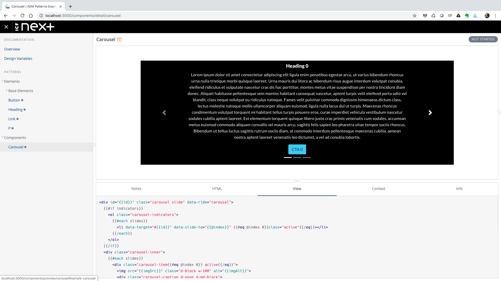

# AEM Patterns

AEM Patterns is a module for AEM that is intended to allow direct reuse of pattern library artifacts by AEM components. 

A standard development workflow for building AEM components from a frontend pattern library involves first packaging the compiled CSS/JS artifacts into an AEM client library. From there, HTL for each component is generated manually using the pattern library's markup templates (usually written in Handlebars) as a guide. This process introduces several unwanted effects into the development lifecycle:

* Transcription of Handlebars into HTL is time consuming and error-prone. The manual nature of the process means that components from the pattern library must be fully retested once imported into AEM.
* Any bug fixes produced for the frontend patterns must be subsequently migrated into the HTL templates.
* The composition patterns available in Handlebars (e.g., a large component being composed of calls into simpler templates such as a heading or button) are difficult to replicate in HTL, often leading to markup for a single frontend pattern being repeated across several HTL files, further complicating any updates to the markup.

The overall effect of these issues is an unnecessary level of coupling between the frontend and AEM development teams.

AEM Patterns seeks to greatly reduce this coupling by allowing pattern templates to be imported as-is into AEM Client Libraries alongside CSS and JS artifacts.

## Benefits

* Separate concerns: Let frontend development teams take full ownership of HTML/JS/CSS, while AEM teams focus on WCM functionality
* Avoid coupling to AEM: Write templates in an implementation-agnostic language and avoid having to train frontend development teams in HTL
* Simplify local development: No need for frontend developers to maintain a local AEM instance
* Reduce retesting: Verify frontend functionality directly in the pattern library, and focus on WCM functionality in AEM

## Usage

A typical HTL-based AEM component generates markup via an HTL template. This template will generally start by initializing a corresponding Sling Model with a `data-sly-use` attribute. The component markup is then rendered, calling properties on the model as necessary.

HTL:
```html
<sly data-sly-use.model="com.example.Model"></sly>
<h1>${model.heading}</h1>
```

Model class:
```java
@Model(adaptables = Resource.class, resourceType = ResourceTypes.MODEL)
public class Model {
    
    @Inject
    private String heading;
    
    public String getHeading() { return heading; }
}
```

AEM Patterns inverts this relationship. Developers will still create a Sling Model exposing all properties required by the template. However, the model now additionally specifies the template it should be called with, using a Sling Model Exporter annotation:

Model class:
```java
@Model(adaptables = Resource.class, resourceType = ResourceTypes.MODEL)
@Exporter(name = ExporterTypes.PATTERN, extensions = "html",
    options = @ExporterOption(name = ExporterOptions.TEMPLATE_PATH, 
        value = "/apps/example/frontend/patterns/model.hbs"))
public class Model {
    
    @Inject
    private String heading;
    
    public String getHeading() { return heading; }
}
```

Handlebars:
```handlebars
<h1>{{heading}}</h1>
```

This exporter annotation registers a servlet serving html requests for the component (`extensions = "html"`). This servlet calls a custom Exporter provided by AEM Patterns (`name = ExporterTypes.PATTERN`) which looks up the desired template (`@ExporterOption(name = ExporterOptions.TEMPLATE_PATH, value = "/apps/example/frontend/patterns/model.hbs")`) and calls the it, supplying the model as context.

The result is a an AEM component that doesn't require any HTL, and which instead uses frontend patterns directly from the pattern library. AEM developers can then create dialogs to expose the properties of a model to authors, or pull property values from a service, or generate them using custom logic, etc.

## Example Project

AEM Patterns comes with an example project demonstrating its use.

### Frontend
The frontend module is a maven module that wraps an npm project. This project consists of a [Fractal](https://fractal.build) pattern library, and a build which produces the compiled CSS and JS files. The pattern library consists of several base patterns (button, heading, link) and a single component, a carousel, which leverages the basic elements.



The wrapping Maven project kicks off the npm build, and copies the frontend artifacts and pattern templates into a ClientLibrary that is then packaged up and installed in AEM.

### Core

The Example Core module revolves around [Carousel.java](example/core/src/main/java/com/icfnext/aem/patterns/example/components/content/Carousel.java), the Sling Model representing an AEM Carousel component. This model uses an @Exporter annotation to generate its markup using the patterns imported into AEM by the frontend project.

### UI

The UI project generates the authoring dialogs for the Carousel component using the cq-component-maven-plugin, and also provides a page template for testing.

## Plugin

Projects can optionally use the provided [ExportFrontendArtifactsPlugin](plugin/src/main/java/com/icfnext/aem/patterns/plugin/ExportFrontendArtifactsPlugin.java) to export frontend artifacts (JS, CSS, static files, and templates) into AEM. The plugin generates an AEM Client Library from the supplied files, which can then be installed into an AEM instance using the Content Package Maven Plugin. See [The AEM Patterns example frontend project](example/frontend/pom.xml) for usage.

Note that the plugin is optional -- any method for installing the pattern templates in AEM is acceptable.

## Languages

AEM Patterns supports Handlebars templates out of the box. However any language with a Java templating engine could theoretically be supported with minimal effort. See [HandlebarsPatternProvider.java](handlebars/src/main/java/com/icfnext/aem/patterns/handlebars/pattern/HandebarsPatternProvider.java) for an example.